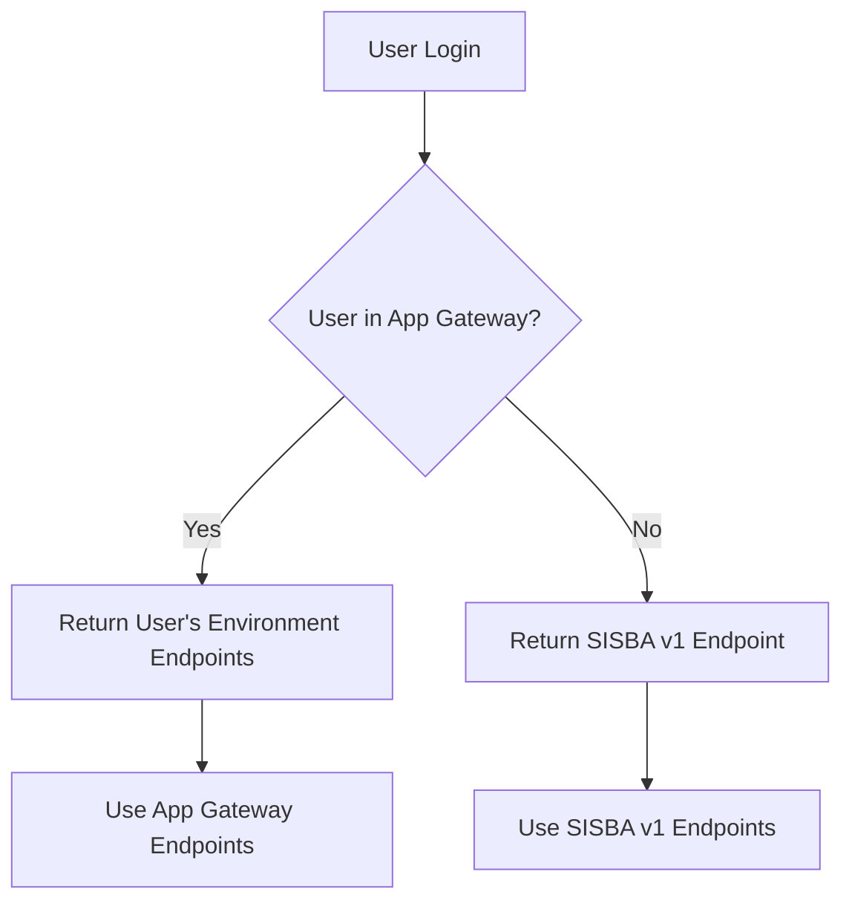

# Mobile Reader App Authentication

<note>
<b>App Gateway</b> resolves mobile apps endpoints to either <b>SisBA v1</b> or <b>HES</b> based on username.    
</note>
<note>
Mobile Reader App 4.0.0 onwards uses App Gateway for endpoint resolution.
Mobile Reader App below 4.0.0 only supports SisBA V1.
</note>

## Login Routing Flow

The mobile reader app follows a specific routing flow for authentication and endpoint resolution. Below is the detailed explanation of the login process:

### Login Flow

1. **Initial Login Request**
   - User enters credentials in the mobile app
   - App retrieves user login endpoint from App Gateway

2. **Endpoint Resolution**
   - App Gateway receives the login request
   - Gateway checks if the user exists in the App Gateway user list

3. **User Routing**
   - **If user is NOT in App Gateway user list:**
     - Returns SISBA v1 endpoint
     - Uses Upload and Download endpoint from SISBA v1 login response payload
   - **If user IS in App Gateway user list:**
     - Returns environment-specific endpoints assigned to the user
     - Uses App Gateway provided endpoints for login, download and upload

## Flowchart

## Environment Management Interface

## User-Environment Management Interface

