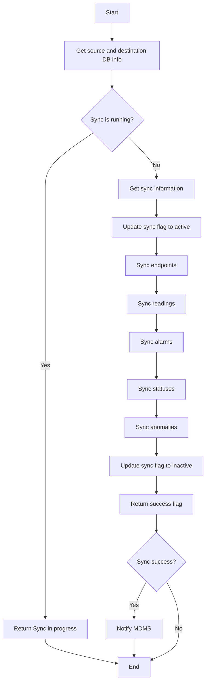

# Data Integration

### ETL Process from HES to MDMS

```mermaid
graph TD
    A[Start] --> A1[Get source and destination DB info];
    A1 --> B{Sync is running?};
    B -- Yes --> C[Return Sync in progress];
    C --> Z[End];
    B -- No --> D[Get sync information];
    D --> E[Update sync flag to active];
    E --> F[Sync endpoints];
    F --> G[Sync readings];
    G --> H[Sync alarms];
    H --> I[Sync statuses];
    I --> J[Sync anomalies];
    J --> K[Update sync flag to inactive];
    K --> L[Return success flag];
    L --> M{Sync success?};
    M -- Yes --> N[Notify MDMS];
    N --> Z;
    M -- No --> Z;
```