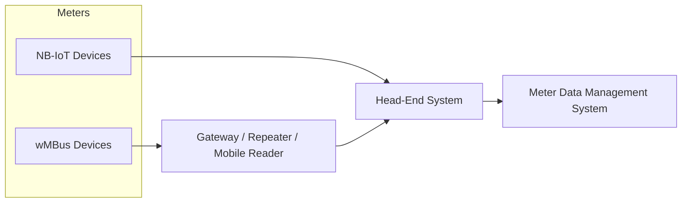

# Introduction

Meter Data Management System (MDMS) is a software platform that collects, processes, stores, and manages data generated
by smart meters in utility networks.




```mermaid
graph TD
subgraph IoT Devices
    NBIoT[Narrowband IoT (NB-IoT) Devices]
    wMBus[Wireless M-Bus (wMBus) Devices]
end

    subgraph Intermediate Systems
        Gateway[Gateway / Repeater / Mobile Reader]
    end

    subgraph Backend Systems
        HES[Head-End System (HES)]
        MDMS[Meter Data Management System (MDMS)]
    end

    %% Data Flow
    NBIoT -->|Direct Communication| HES
    wMBus --> Gateway -->|Data Aggregation| HES
    HES -->|Integrates Data| MDMS
```