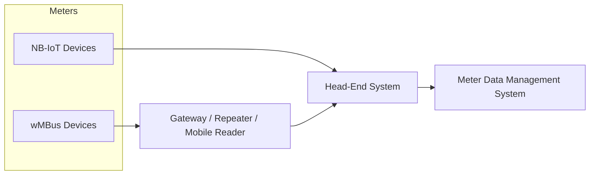

# Meter Data Management System (MDMS)

Meter Data Management System (MDMS) is a software platform that collects, processes, stores, and manages data generated
by smart meters in utility networks.

```mermaid
flowchart LR
%%{init:{'flowchart':{'nodeSpacing': 80, 'rankSpacing': 30}}}%%
    subgraph Meters
        direction LR
        A[NB-IoT Devices]
        B[wMBus Devices]
    end

    A ---> C[Head-End System]
    B --> D[Gateway / Repeater / Mobile Reader] --> C
    C --> E[Meter Data Management System]
```