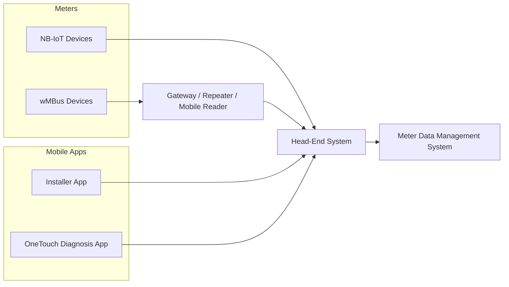

# SisBA

SisBA is a comprehensive software suite designed to streamline and optimize smart metering operations. It consists of three key components:

### Head-End-System (HES)
[Link](Head-End-System-HES.md)

The core system responsible for communicating with metering devices. It collects data, manages commands, and ensures reliable two-way communication between smart meters and the central system.

### Meter Data Management System (MDMS)
A robust platform for storing, processing, and analyzing metering data collected from the HES. It supports functions like billing, reporting, and advanced analytics to help utilities make data-driven decisions.
### Installer App:
A mobile application tailored for field technicians to facilitate the installation and configuration of meters. It ensures smooth onboarding of devices into the system and provides real-time guidance during installations.